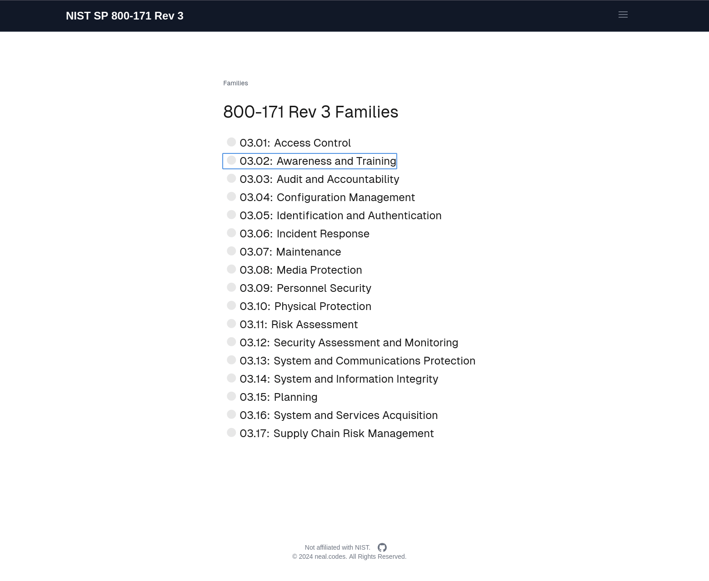

# NIST SP 800-171 Rev 3

I built this because it was challenging to find resources for [NIST 800-171 Revision 3](https://csrc.nist.gov/publications/detail/sp/800-171/rev-3/final) and [CMMC](https://dodcio.defense.gov/cmmc/About/) compliance.

By going through the 800-171 controls, you can generate a markdown file with all statuses and notes for each security control. Withdrawn controls are filtered out from the revision 2 -> revision 3 migration.

## Features

- Stores data client-side using [IndexedDB](https://developer.mozilla.org/en-US/docs/Web/API/IndexedDB_API), ensuring no privacy concerns
- Generates a markdown file for compliance (Good for System Security Plan!)
- Allows for exporting and importing the database for archived storage

## Usage

1. Go to [nist-sp-800-171](https://nist-sp-800-171.neal.codes/)
2. Start working through security controls for a family
3. Choose whether it has been implemented or not, and any notes
4. Click `Generate Markdown` to download a markdown document whenever

### Icon Meanings

- 🟢 A family, requirement, or security requirement is implemented.
- 🔴 A family, requirement, or security requirement is not implemented.
- ⚫ A family, requirement, or security requirement is not applicable.
- ⚪ A family, requirement, or security requirement has not been started (default).
- 🟤 A family or requirement is partially implemented (some security requirements are implemented and not implemented)
- 🟡 A family or requirement has remaining work.

## Privacy

All data is stored locally on your device using [IndexedDB](https://developer.mozilla.org/en-US/docs/Web/API/IndexedDB_API). There are no privacy concerns, as no data is sent to any server.

## Resources

- [NIST 800-171 Revision 3 Final](https://csrc.nist.gov/publications/detail/sp/800-171/rev-3/final).
- JSON used for the application from [csrc.nist.gov](https://csrc.nist.gov/extensions/nudp/services/json/nudp/framework/version/sp_800_171_3_0_0/export/json?element=all).
- [CMMC COA](https://cmmc-coa.com/) is a great resource as well for CMMC.

## License

This project is licensed under the MIT License. I have no affiliation with NIST.

Made the app in a couple days... don't expect the best code.
