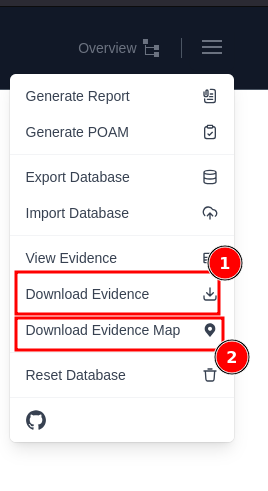

# Postprocessing

## Gathering Evidence

Download all the evidence and the evidence map. Since this is done in the browser, this will most likely end up in your `Downloads` folder.

1. Click on `Download Evidence`
2. Click on `Download Evidence Map`



## Sorting Evidence by Requirement

The evidence can then be moved into the requirement subfolders.

```bash
./scripts/postprocessing/sort-evidence-by-mapping.sh \
    ~/Downloads/cmmc-800-171-rev-2-evidence-map-\*.json \
    ~/Downloads \
    ~/Downloads/organized
```

Using the map file, this will put all evidence in their respective sub-requirement e.g. `03/01/01/my-evidence.png`. This path will be used by the SSP generated from the `Generate Report` menu item.

## Generating Evidence Report

You can also generate an evidence report in markdown using the following:

```bash
./scripts/postprocessing/generate-evidence-mapping-report.sh \
    ~/Downloads/cmmc-800-171-rev-2-evidence-map-*.json
```
